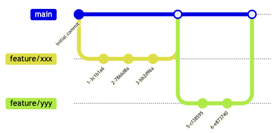

<!-- class:  title-page -->

<div class="title">
    Git応用編
</div>

<div class="meta">
citrus88<br>
citrus.mikan88@gmail.com<br>
初版: 2025/08/05<br>
更新日: 2025/08/05<br>
</div>

---

# はじめに

## 想定読者

- Gitを使ったチーム開発を行いたい人
- Gitを使って個人開発でバージョン管理を行っている人

## 本資料のゴール

- Gitを使ってチーム開発ができる
- Gitの応用的な使い方ができる

## この資料で説明しないこと

- Gitの基本的な内容
- GitHub/GitLabの詳細な使い方

# チーム開発におけるGitの利点

- すべての変更履歴が完全に記録されるため、問題が発生した際に原因となった変更を特定し、責任の所在を明確にできる
- 各開発者が独立してブランチで作業を行い、完成した機能を統合することで、お互いの作業を妨げることなく開発を進められる
- 中央のリモートリポジトリを通じて、常に最新かつ安定したコードを共有できるため、チーム全体の作業効率が向上する
- 分散版本管理システムにより、各開発者がローカルで完全な履歴を持つため、ネットワークが不安定な環境でも安定した開発が可能
- コンフリクト(競合)が発生した場合でも、Gitの強力なマージ機能により安全に解決でき、複数人での同時編集によるデータ消失を防げる

---

# Gitのブランチ戦略

まず，Gitのブランチ戦略について紹介する．
Gitを用いてチームで開発する時，ブランチを適切に管理することで、開発効率を向上させることができる．
ここでは，よく使われてシンプルなGitHub Flowについて説明する．

## GitHub Flow

GitHub Flowはシンプルで理解しやすいブランチ戦略である．少人数の開発で用いられ，頻繁にリリースする場合に適している．GitHub Flowのキーポイントは，「mainブランチが常に本番環境と同期している．すべての作業ブランチはmainから分岐してコードレビューを通してmainにマージされる」ことである．作業ブランチは開発内容に合わせてfeature, bugfix, docsなどと名前をつける．．作業ブランチは一つのブランチ内での変更内容の粒度を小さくし，短い間隔でmainへマージできるようにする．

- **main**：常にデプロイ可能な状態を保つ
- **feature, bugfix, docs**：作業用のブランチ．
  - **feature**：新機能開発用のブランチ（`feature/機能名`）
  - **bugfix**：バグ修正用のブランチ（`bugfix/バグ名`）
  - **docs**：ドキュメント更新用のブランチ（`docs/ドキュメント名`）

GitHub Flowの流れは以下である．

1. 新しいfeatureブランチを作成
2. 機能開発とコミット
3. プルリクエスト(マージリクエスト)を作成
4. コードレビュー
5. mainブランチにマージ
6. 本番環境にデプロイ

GitHub Flowのブランチの様子は以下である．


- [GitHub Docs](https://docs.github.com/ja/get-started/using-github/github-flow)

それ以外の有名なブランチ戦略は以下である．

- Git Flow
  - []()
- GitLab Flow
  - []()
- Trunk-Based Flow
  - []()

---

# チーム開発の流れ

Gitを用いてチーム開発する

1. (初回のみ)リモートリポジトリの作成する
2. (初回のみ)リモートリポジトリをローカル環境に複製する(clone)
3. ブランチ戦略に沿って，ブランチ作成する
4. ファイルの編集・コミットし，開発を進める
5. ブランチをリモートリポジトリへプッシュする
6. レビューを行う
7. マージする
8. 各開発者はmainブランチの変更履歴をローカルリポジトリに取り込み，必要に応じて現在作業しているブランチにも取り込む．

---

# チーム開発: リモートリポジトリの作成と複製

## リモートリポジトリの作成

1. GitHubやGitLabでリポジトリを作成
2. README.mdや.gitignoreファイルの追加
3. リポジトリのURLを確認

## リモートリポジトリの複製

```bash
# HTTPSでクローン
git clone https://github.com/username/repository.git

# SSHでクローン
git clone git@github.com:username/repository.git
```

---

# チーム開発: ブランチ作成

```bash
# 最新のmainブランチに移動
git checkout main
git pull origin main

# 新しいfeatureブランチを作成・移動
git checkout -b feature/new-function

# または
git switch -c feature/new-function
```

**ブランチ名の命名規則例：**

- `feature/機能名`：新機能開発
- `fix/バグ名`：バグ修正
- `docs/ドキュメント名`：ドキュメント更新

---

# チーム開発: リモートリポジトリへプッシュ

```bash
# ローカルでの変更をコミット
git add .
git commit -m "機能の実装完了"

# リモートリポジトリにプッシュ
# 初回プッシュ時
git push -u origin feature/new-function

# 2回目以降
git push
```

**コミットメッセージのベストプラクティス：**

- 簡潔で明確な説明
- 何を「なぜ」変更したかを記述
- 50文字以内の要約から始める

---

# チーム開発: レビューを行う

## Pull Request（プルリクエスト）の作成

1. GitHubでPull Requestを作成
2. 変更内容の説明を記載
3. レビュアーを指定
4. 必要に応じてラベルやマイルストーンを設定

## コードレビューのポイント

- **機能性**：コードが意図した通りに動作するか
- **可読性**：他の開発者が理解しやすいか
- **保守性**：将来の変更に対応しやすいか
- **テスト**：適切なテストが含まれているか

---

# チーム開発: マージする

## マージの方法

### 1. Merge Commit（マージコミット）

```bash
git checkout main
git merge feature/new-function
```

- すべての履歴が保持される
- マージコミットが作成される

### 2. Squash and Merge

- featureブランチのコミットを1つにまとめる
- 履歴がシンプルになる

### 3. Rebase and Merge

- 線形な履歴を保つ
- マージコミットが作成されない

---

# チーム開発: 変更履歴を取り込む

```bash
# mainブランチに移動
git checkout main

# リモートの最新変更を取得
git pull origin main

# または fetch + merge
git fetch origin
git merge origin/main
```

## ブランチの削除

```bash
# ローカルブランチの削除
git branch -d feature/new-function

# リモートブランチの削除
git push origin --delete feature/new-function
```

---

# Gitの便利機能

- `git stash`
- `git rebase`
- `git cherry-pick`
- `git blame`
- Gitエイリアス設定

---

# git stash

作業中の変更を一時的に退避する機能

```bash
# 変更を退避
git stash

# メッセージ付きで退避
git stash push -m "作業中の変更を一時保存"

# 退避した変更を戻す
git stash pop

# 退避リストを確認
git stash list

# 特定の stash を適用
git stash apply stash@{0}
```

**使用場面：**

- 緊急のバグ修正で別ブランチに切り替える必要がある
- Pull前に未コミットの変更がある

---

# git rebase

履歴を整理してマージする機能

```bash
# インタラクティブリベース
git rebase -i HEAD~3

# 別ブランチにリベース
git rebase main

# リベース中止
git rebase --abort

# リベース継続
git rebase --continue
```

**rebaseの利点：**

- 線形で分かりやすい履歴
- 不要なマージコミットの削除
- コミットメッセージの編集・統合

---

# git cherry-pick

特定のコミットを別ブランチに適用

```bash
# 特定のコミットを現在のブランチに適用
git cherry-pick <commit-hash>

# 複数のコミットを適用
git cherry-pick <commit1> <commit2>

# コミット作成せずに変更のみ適用
git cherry-pick --no-commit <commit-hash>
```

**使用場面：**

- 特定のバグフィックスを複数ブランチに適用
- リリースブランチに必要な機能のみを選択的に適用

---

# git blame

各行の最終更新者と更新日時を確認

```bash
# ファイル全体の blame
git blame filename.txt

# 特定の行範囲
git blame -L 10,20 filename.txt

# より詳細な情報
git blame -w -C filename.txt
```

**活用方法：**

- バグの原因調査
- コードの変更履歴の確認
- レビューやペアプログラミングの効率化

---

# その他の便利機能

## タグ付け

```bash
# 軽量タグの作成
git tag v1.0.0

# 注釈付きタグの作成
git tag -a v1.0.0 -m "リリース版 1.0.0"

# タグをリモートにプッシュ
git push origin v1.0.0

# すべてのタグをプッシュ
git push origin --tags
```

## .gitignore

管理対象外にするファイルを指定

```
# コメント
*.log
node_modules/
.env
.DS_Store
```

## ログの活用

```bash
# グラフィカルな履歴表示
git log --oneline --graph --all

# 特定作者のコミット
git log --author="username"

# ファイルの変更履歴
git log --follow filename.txt
```

## Gitエイリアス設定

```bash
# よく使うコマンドを短縮
git config --global alias.co checkout
git config --global alias.br branch
git config --global alias.ci commit
git config --global alias.st status
git config --global alias.lg "log --oneline --graph --all"
```

---

## まとめ

- 応用コマンドで効率的な開発を
- チームの運用ルールを守ることが重要
- ドキュメントやhelpコマンドを活用

---
