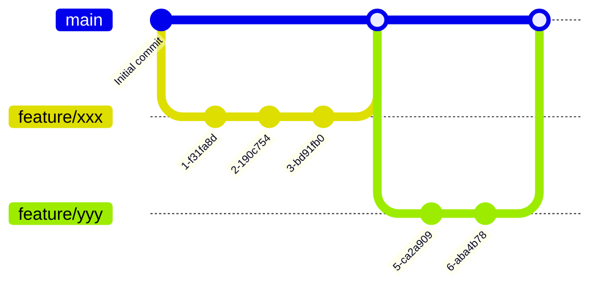
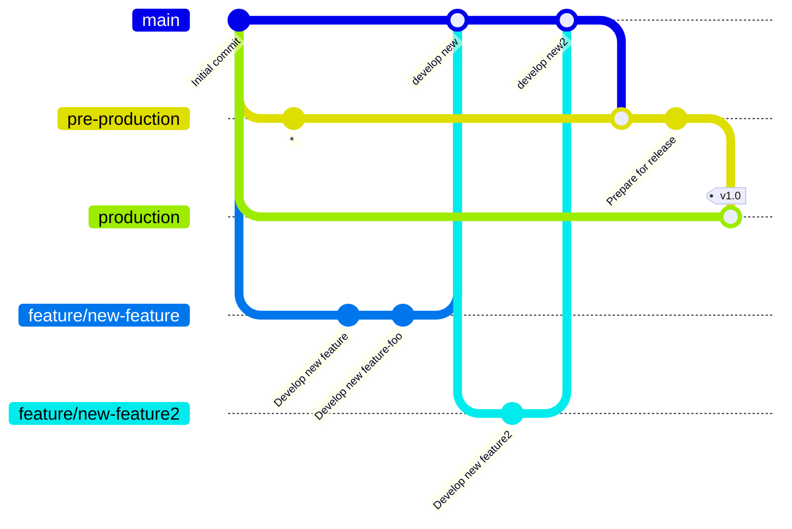
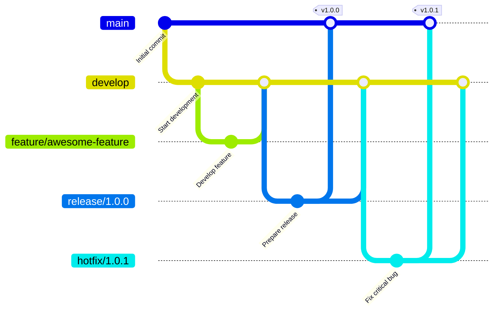
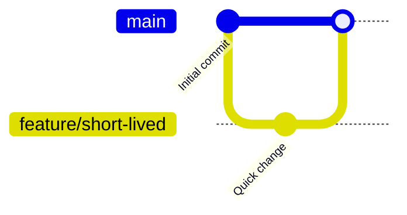
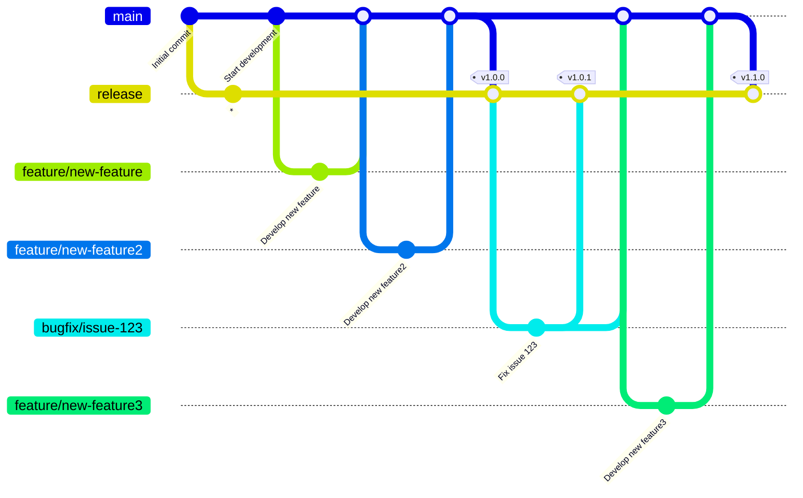
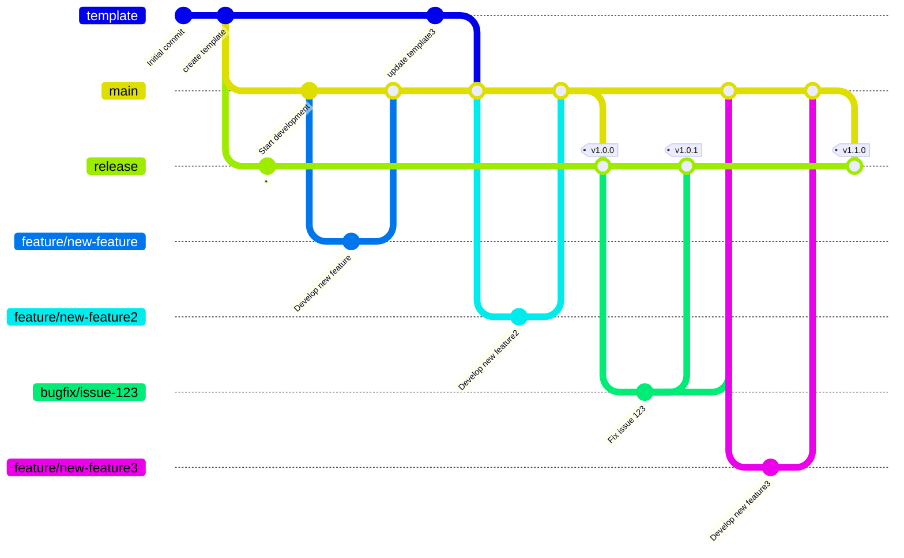

GitHub Flow

### Gitフロー

Git Flowは，Vincent Driessen氏が提唱した体系的なブランチ戦略で，以下のブランチを使用する．

- main：本番環境にリリースされるコードを管理する．
- develop：次のリリースに向けた開発を行うブランチ．
- feature/\*：新機能の開発用ブランチ．developから派生し，開発後にdevelopへマージする．
- release/\*：リリース準備用ブランチ．developから派生し，最終調整後にmainとdevelopへマージする．
- hotfix/\*：本番環境での緊急バグ修正用ブランチ．mainから派生し，修正後にmainとdevelopへマージする．

適した開発条件

- 大規模プロジェクトや計画的なリリースサイクルを持つプロジェクト．
- 複数の開発者が並行して作業するチーム．
- 本番環境と開発環境を明確に分離したい場合．

### トランクベース開発

トランクベース開発は，main（またはtrunk）ブランチを中心に開発を進める戦略で，以下の特徴がある．

- 開発者はmainブランチに直接コミットするか，短命のブランチを使用して作業後すぐにmainへマージする．
- フィーチャーフラグや条件分岐を活用して，未完成の機能を本番環境に影響を与えずにデプロイ可能とする．

適した開発条件

- 継続的デリバリー（CD）を強く推進するプロジェクト．
- 高頻度のデプロイやリリースを行う必要がある場合．
- 小規模チームやアジャイル開発を実践しているチーム．

## 自作フロー

### 開発フロー

今回，自分の開発スタイルに合わせたブランチ戦略を考える．
Gitフローはブランチ戦略が複雑であり，GitHubフローはブランチ戦略がシンプルすぎるため，その中間的なGitLabフローをメインに考える．
一方で，GitLabフローのpre-productionブランチについて，リリース前の確認のためにブランチを作成する必要ないと考える．
一方で，リリース後のバグ修正のために，bugfixブランチを作成する必要があると考える．
よって，以下のブランチ戦略を採用する．
今回，

- main：開発の主軸となるブランチ
- release：リリースブランチ．mainからマージされる．バージョンごとにタグをつけていく
- feature/\*：新機能や修正を行うブランチ．mainから派生．
- bugfix/\*：バグ修正用ブランチ．releaseから派生．修正後にmainとreleaseへマージする．

補足

- コミットIDの "\*" は，gitGraphを書くために無理やりつけたものであり，実際のgitでは存在しない．

### フォークを用いた開発テンプレートの利用時

開発テンプレートが別のリポジトリにあり，それをフォークして開発を行う場合，以下のブランチ戦略を採用する．

- template：テンプレート開発のブランチ．フォーク元のリポジトリが変更された場合，必要に応じて更新し，mainへマージする．
- main：開発の主軸となるブランチ
- release：リリースブランチ．mainからマージされる．バージョンごとにタグをつけていく
- feature/\*：新機能や修正を行うブランチ．mainから派生．
- bugfix/\*：バグ修正用ブランチ．releaseから派生．修正後にmainとreleaseへマージする．

