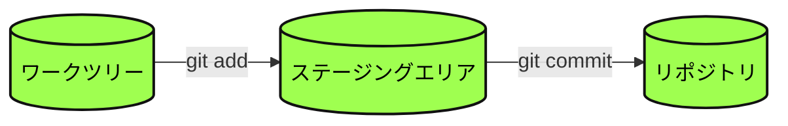
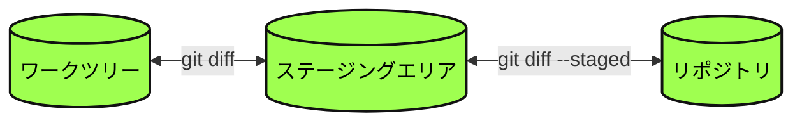

```mermaid
flowchart LR
    A[(ワークツリー)]  -- "git add" --> B[(ステージングエリア)]
    B -- "git commit" --> C[(リポジトリ)]

    %% ファイルの流れ
    style A color:#000,fill:#9fff50,stroke:#111,stroke-width:2px
    style B color:#000,fill:#9fff50,stroke:#111,stroke-width:2px
    style C color:#000,fill:#9fff50,stroke:#111,stroke-width:2px

    %% 説明
    classDef explain fill:#fff,stroke:#fff;
```

---

```mermaid
flowchart LR
    A[(ワークツリー)]  <-- "git diff" --> B[(ステージングエリア)]
    B <-- "git diff --staged" --> C[(リポジトリ)]

    %% ファイルの流れ
    style A color:#000,fill:#9fff50,stroke:#111,stroke-width:2px
    style B color:#000,fill:#9fff50,stroke:#111,stroke-width:2px
    style C color:#000,fill:#9fff50,stroke:#111,stroke-width:2px

    %% 説明
    classDef explain fill:#fff,stroke:#fff;
```
